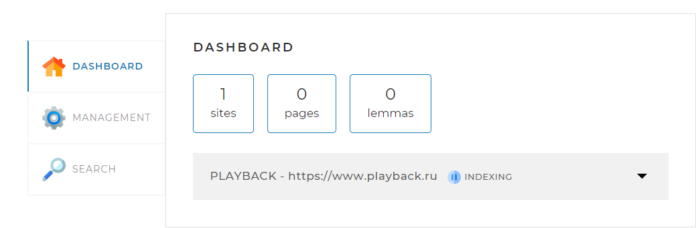
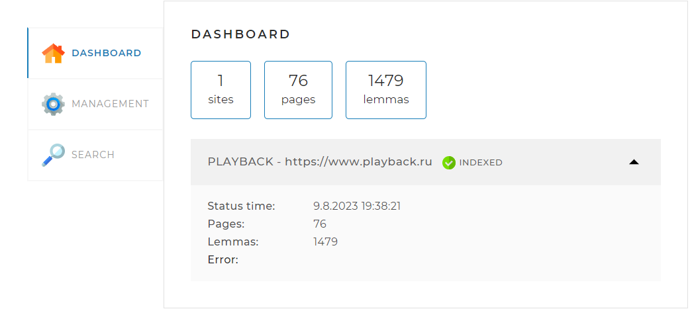
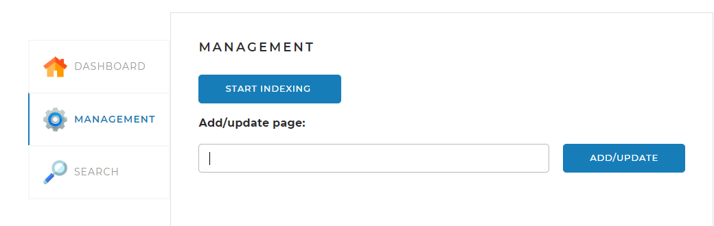
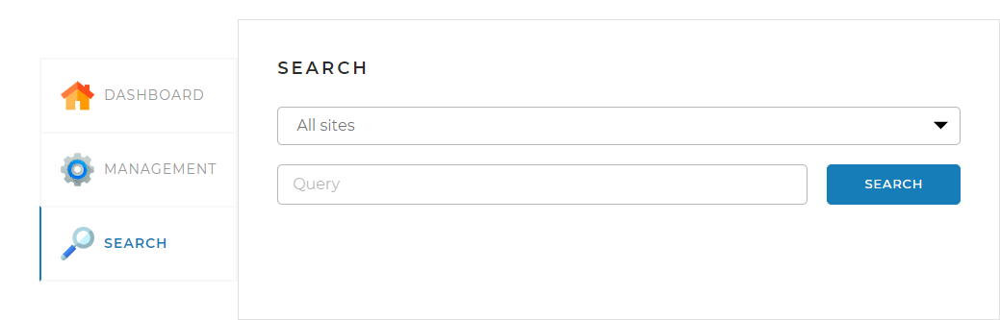
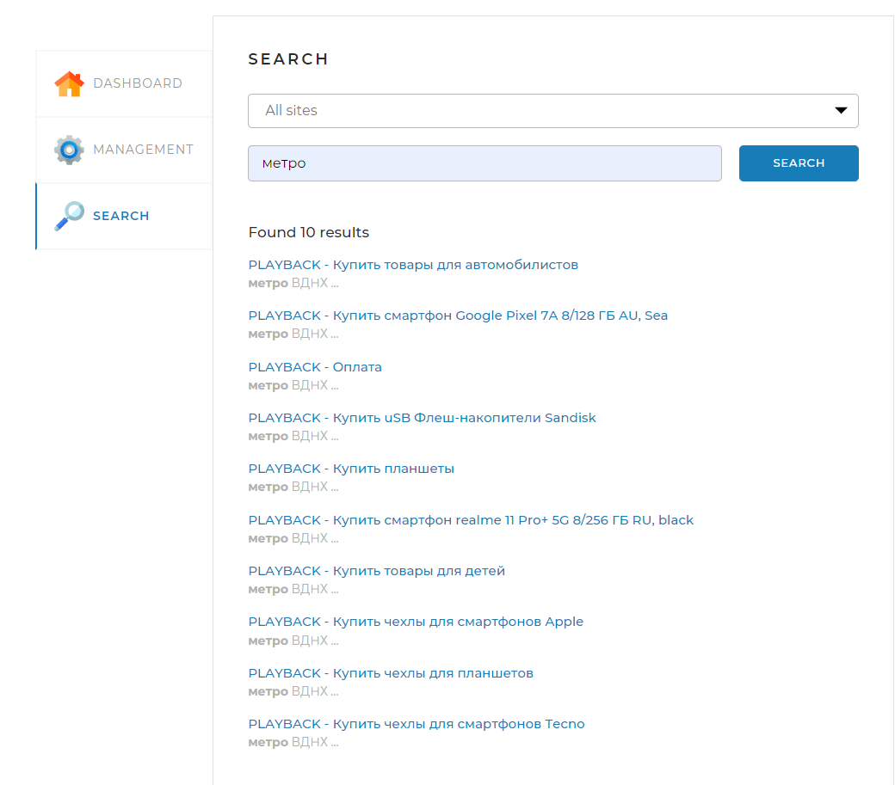

# Поисковой движок
Данное приложение позволяет индексировать страницы и осуществлять 
по ним быстрый поиск.
## Веб-страница

Частью проекта является веб-страница, предоставляющая возможность 
управления процессами.

Страница содержит три вкладки:

### Вкладка DASHBOARD 
 - Открывается по-умолчанию. В этой вкладке отображается общая статистика 
по всем проиндексированным сайтам, а также детальная статистика и статус
по каждому из сайтов (статистика, получаемая по запросу <i>/statistics</i>). 

  
 - Отображение процесса индексации [INDEXING]. 
Для примера взят сайт https://www.playback.ru. 
Для корректной работы приложения, необходимые для индексации сайты, 
нужно указать в конфигурационном файле _**application.yml**_. 
Путь к файлу: _**src/main/resources/application.yml**_.

  
 - Отображение выполненной индексации [INDEXED] с детальной статистикой.
Пустое поле Error: говорит об отсутствии ошибок во время индексации сайта.

### Вкладка MANAGEMENT 
 - На данной вкладке расположены средства управления поисковым движком,
   включая возможность запуска - нажатие
   ,
   либо через запрос **_/startIndexing_**.  
   Остановить индексацию можно через запрос **_/stopIndexing_**.  
   Для переиндексации необходимо ввести в поле Add/update page сайт,
   указанный в конфигурационном файле и нажать , 
   либо через запрос _**/indexPage/{pagePath}**_, где pagePath - адрес сайта 
   для переиндексации.  
   

### Вкладка SEARCH 
 - На этой вкладке находятся инструменты управления поиском: 
в выпадающем списке есть возможность выбрать определенный сайт, либо оставить 
_**"All sites"**_ для поиска по всем ранее индексированным сайтам, 
ввести запросв поле _**Query**_ и начать поиск,
нажав ,
либо используя запрос /startIndexing.
запрос _**/search?query=ЗАПРОС&offset=0&limit=10&site=САЙТ**_, 
где ЗАПРОС - интересующая вас информация,а САЙТ - адрес конкретного сайта, 
на котором вы хотите её найти(например, https://www.playback.ru). 
Если САЙТ не указан, поиск будет совершен по всем индексированным ранее сайтам.  
 
  
 - После выполнения поиска, вы получите сортированный по релевантности список
ссылок.
   
  

## Настройки Spring Boot приложения
### Работа с базами данных

<li>
В настоящее время приложение сконфигурировано для взаимодействия с базой данных
MySQL. Кроме того, в файлах конфигурации <i>pom.xml</i> и <i>application.yml</i>
присутствуют закомментированные записи, связанные с настройками для работы 
с базой данных H2. В них задаются параметры СУБД, в которой приложение хранит 
данные конфигурации. База данных создаётся на основе классов из пакета
<i>src/main/java/searchengine/persistence/model</i>

### Конфигурация JPA
jpa:  
    hibernate:  
      ddl-auto: _**create-drop**_  
<li>Совместно эти две опции (create и drop) обеспечивают автоматическое создание 
схемы и таблиц при запуске приложения и их автоматическое удаление при 
завершении работы. Это удобно, когда вам нужна временная или
база данных, которая может меняться в процессе разработки и тестирования.  
Однако стоит отметить, что использование режима "create-drop" следует 
ограничивать на этапе разработки, чтобы избежать потери данных в боевой среде.
Поэтому, при следующих запусках, рекомендуется установить значение этого параметра

### Раздел <i>logging</i>
 - Логгирование осуществляется использованием аннотации **@Slf4j**. Все логи прописываются
в консоли.

## Используемые технологии
Приложение основано на платформе Spring Boot. 
Необходимые компоненты собираются при помощи инструмента сборки Maven. 
Maven автоматически включает следующие стартеры, связанные с Spring Boot:

 - "spring-boot-starter-web" — этот стартер внедряет необходимые 
библиотеки для выполнения функций Spring-MVC приложения. Взаимодействие между 
браузером и сервером осуществляется через технологию AJAX;

 - "spring-boot-starter-data-jpa" — этот стартер обеспечивает подключение к 
базе данных, предоставляя соответствующие библиотеки;

 - "spring-boot-starter-thymeleaf" — данный стартер предоставляет 
функциональность для шаблонизации веб-страниц;

 - "org.apache.lucene.morphology", "org.apache.lucene.analysis" - данный стартер 
используется для работы работы с лемматизацией текста;

 - "mysql-connector-java" - драйвер для подключения и работы с MySQL.

 - "com.h2database" - драйвер для подключения и работы с H2.

 - Для скачивания и анализа веб-страниц применяется библиотека jsoup;

 - Для улучшения процесса написания и чтения Java-кода, а также для расширения 
   функциональности, используется библиотека Lombok (зависимость "lombok");

## Запуск программы
Репозиторий с приложением SearchEngine находится по адресу
[https://github.com/ShCodeNik/SearchEngine.git](https://github.com/ShCodeNik/SearchEngine.git).

Если проект загрузить на локальный диск, то он готов к тому,
чтобы его можно было скомпилировать и запустить с помощью среды
разработки IntelliJ IDEA. 

Перед первой компиляцией программы следует выполнить следующие шаги:
<ol>
<li>
Установить СУБД MySQL, если еще не установлена. Для работы с H2 установка не требуется.
</li>
<li>
В базе данных создать схему <i>search_engine</i>. Имя схемы может быть 
другим, но тогда это должно быть отражено в параметре
<i>spring.datasource.url</i> в файле <i>application.yml</i>.
</li>
<li>
В схеме нужно создать пользователя <i>root</i> с паролем 
<i>testtest</i>. Либо же внести корректировки в  <i>spring.datasource.username</i> и 
<i>spring.datasource.password</i> в файле <i>application.yaml</i>, соответствующие 
вашим параметрам.
</li>
<li>
Установить фреймворк Apache Maven, если он ещё не установлен.
</li>
<li>
В командной оболочке (например, PowerShell) перейти в корневой каталог проекта
и выполнить пакетный файл <i>init_morphology.cmd</i>:

`.\init_morphology.cmd`.
</li>

</ol>

Теперь приложение можно компилировать и запускать из среды разработки.
<i>После успешного запуска приложения в среде разработки, для работы необходимо перейти
по адресу: [http://localhost:8080/]()

